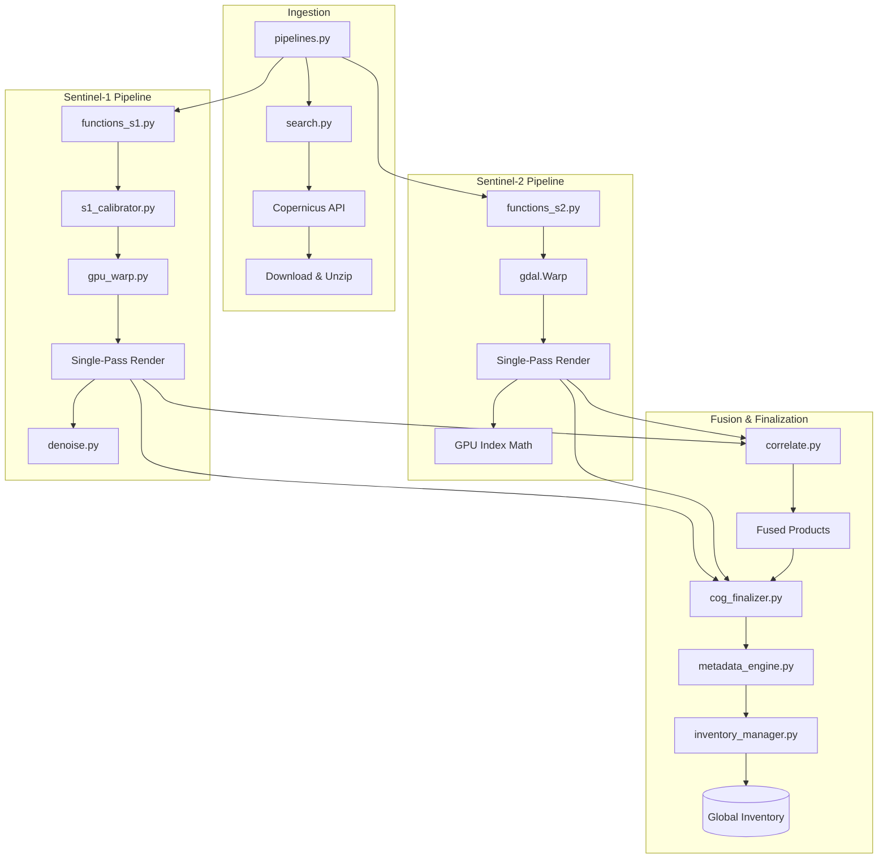

# Project Overview: python-sentinel-pipeline

This document provides a technical inventory of the Python scripts and the architectural data flow for the Sentinel-1, Sentinel-2, and Fusion pipelines.

## Python Script Inventory

| Script | Purpose |
| :--- | :--- |
| `pipelines.py` | **Master Orchestrator**: Triggers searching, downloading, and the sequential execution of S1 and S2 pipelines. |
| `search.py` | **Discovery**: Interfaces with Copernicus CDSE OData API to find products based on bounding boxes and dates. |
| `functions_s1.py` | **S1 Logic**: Manages the Sentinel-1 workflow: calibration -> warping -> single-pass rendering. |
| `s1_calibrator.py` | **S1 Calibration**: High-performance radiometric calibration and thermal noise removal for SAR data. |
| `functions_s2.py` | **S2 Logic**: Manages the Sentinel-2 workflow: warping -> multispectral index math -> rendering. |
| `correlate.py` | **Fusion Engine**: Detects spatio-temporal overlaps between S1/S2 and generates "Fused" products. |
| `gpu_warp.py` | **CUDA Warper**: High-speed, GPU-accelerated coordinate remapping and reprojection. |
| `denoise.py` | **SAR Filters**: Implements Lee, Frost, and Gamma Map denoising (CPU or CUDA). |
| `cog_finalizer.py` | **Optimization**: Converts standard GeoTIFFs into Cloud-Optimized GeoTIFFs (COG) for fast web display. |
| `inventory_manager.py` | **Cataloger**: Compiles a global `inventory.json` used by the frontend to list available layers. |
| `metadata_engine.py` | **Sidecars**: Generates `.json` metadata files for every visual TIF (bounds, time, legend IDs). |
| `legends.py` | **Visuals**: Defines HTML/CSS legends for the various index and fusion products. |
| `functions.py` | **Utilities**: General helpers and the system-wide performance/resource logger. |
| `constants.py` | **Config**: Central store for directory paths, band mappings, and rendering constraints. |
| `cleanup.py` | **Maintenance**: Removes products older than a specified number of days and cleans up logs. |
| `rebuild_metadata.py` | **Maintenance**: Regenerates all sidecar JSONs for existing visual TIFFs (e.g. after a metadata format change). |

---

## Pipeline Architecture

---

## Workflow Automation & Usage

### The Master Pipeline (`pipelines.py`)
Running `python pipelines.py` performs the following steps autonomously:
1.  **Search & Download**: Queries the Copernicus API for S1/S2 products matching your `.env` bounding boxes with a start date of **yesterday**.
2.  **S1 Processing**: Calibrates, warps, and renders SAR products (VV, VH, Ratio).
3.  **S2 Processing**: Warps and renders multispectral indices (NDVI, NDBI, etc.).
4.  **Sensor Fusion**: Correlates the new S1 and S2 data to create "RADAR-BURN" and "TARGET-PROBE" composites.
5.  **Finalization**: Converts all visuals to Cloud-Optimized GeoTIFFs (COG) and rebuilds the `inventory.json` for the frontend.

### Manual / Maintenance Steps
While `pipelines.py` handles the daily automation, you can interact with components separately:
*   **Processing Existing Data**: Since the master pipeline only processes *newly discovered* data, if you want to re-process older data already in your `temp/` directory, you must call the sensor-specific `run_pipeline` function (from `functions_s1` or `functions_s2`) via a custom script.
*   **Inventory Rebuild**: If you manually delete or add TIF files in the `output/` directory, run `python inventory_manager.py` to refresh the layer list used by the web interface.
*   **Legend Generation**: Run `python legends.py` if you modify the colormaps or HTML templates for the legends.
