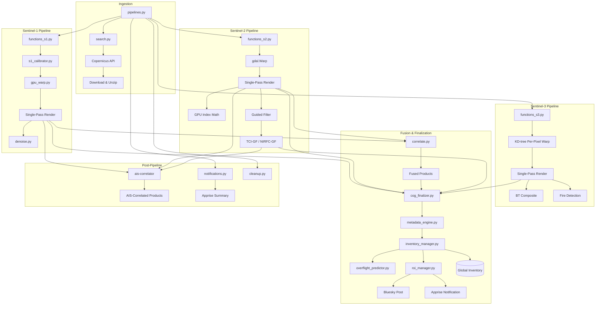

# Project Overview: python-sentinel-pipeline

This document provides a technical inventory of the Python scripts and the architectural data flow for the Sentinel-1, Sentinel-2, Sentinel-3, and Fusion pipelines.

## Python Script Inventory

| Script | Purpose |
| :--- | :--- |
| `pipelines.py` | **Orchestrator**: Triggers searching, downloading, and the sequential execution of S1 and S2 pipelines. |
| `search.py` | **Discovery**: Interfaces with Copernicus CDSE OData API to find products based on bounding boxes and dates. |
| `functions_s1.py` | **S1 Logic**: Manages the Sentinel-1 workflow: calibration -> warping -> single-pass rendering. |
| `s1_calibrator.py` | **S1 Calibration**: Radiometric calibration and thermal noise removal for SAR data. |
| `functions_s2.py` | **S2 Logic**: Manages the Sentinel-2 workflow: warping -> multispectral index math -> rendering -> guided filter post-processing. |
| `functions_s3.py` | **S3 Logic**: Manages the Sentinel-3 SLSTR workflow: KD-tree per-pixel warp from tie-point arrays -> BT composite rendering -> fire detection (hot-body colormap with transparent background). |
| `correlate.py` | **Fusion Engine**: Detects spatio-temporal overlaps between S1/S2 and generates "Fused" products (RADAR-BURN, LIFE-MACHINE, TARGET-PROBE-V2). |
| `gpu_warp.py` | **CUDA Warper**: High-speed, GPU-accelerated coordinate remapping and reprojection. |
| `denoise.py` | **SAR Filters**: Implements Lee, Frost, and Gamma Map denoising (CPU or CUDA). |
| `cog_finalizer.py` | **Optimization**: Converts standard GeoTIFFs into Cloud-Optimized GeoTIFFs (COG) for fast web display. |
| `inventory_manager.py` | **Cataloger**: Compiles a global `inventory.json` used by the frontend to list available layers, includes overflight predictions. |
| `metadata_engine.py` | **Sidecars**: Generates `.json` metadata files for every visual TIF (bounds, time, legend IDs, cloud cover, orbit metadata). |
| `legends.py` | **Visuals**: Defines HTML/CSS legends for the various index and fusion products. |
| `functions.py` | **Utilities**: General helpers and the system-wide performance/resource logger. |
| `constants.py` | **Config**: Central store for directory paths, band mappings, rendering constraints, and guided filter defaults. |
| `cleanup.py` | **Maintenance**: Removes products older than a specified number of days, cleans up ROI crops, source data, and logs. |
| `rebuild_metadata.py` | **Maintenance**: Regenerates all sidecar JSONs for existing visual TIFFs (e.g. after a metadata format change). |
| `notifications.py` | **Notifications**: Sends pipeline run summaries and ROI updates via Apprise (Discord, Telegram, etc.). |
| `roi_manager.py` | **ROI Cropping**: Extracts region-of-interest crops from full-tile products, posts to Bluesky, sends Apprise notifications. |
| `roi_animator.py` | **Animation**: Generates ordered PNG sequences from ROI crops for timelapse creation. |
| `overflight_predictor.py` | **Prediction**: Predicts next Sentinel overflights using TLE data from Celestrak and Skyfield orbital propagation. Generates GeoJSON swath overlays for the viewer. |
| `ais-correlator/ais_correlator.py` | **AIS Correlation**: Overlays AIS vessel metadata onto S1-RATIO imagery (primary) or S2-TCI (optional) to identify dark vessels or those transmitting false coordinates. |

---

## Pipeline Architecture

```mermaid
graph TD
    subgraph "Ingestion"
        P[pipelines.py] --> S[search.py]
        S --> D[Copernicus API]
        D --> DL[Download & Unzip]
    end

    subgraph "Sentinel-1 Pipeline"
        P --> S1P[functions_s1.py]
        S1P --> S1C[s1_calibrator.py]
        S1C --> S1W[gpu_warp.py]
        S1W --> S1R[Single-Pass Render]
        S1R --> DN[denoise.py]
    end

    subgraph "Sentinel-2 Pipeline"
        P --> S2P[functions_s2.py]
        S2P --> S2W[gdal.Warp]
        S2W --> S2R[Single-Pass Render]
        S2R --> IDX[GPU Index Math]
        S2R --> GF[Guided Filter]
        GF --> GF_OUT[TCI-GF / NIRFC-GF]
    end

    subgraph "Sentinel-3 Pipeline"
        P --> S3P[functions_s3.py]
        S3P --> S3W[KD-tree Per-Pixel Warp]
        S3W --> S3R[Single-Pass Render]
        S3R --> BT[BT Composite]
        S3R --> FIRE[Fire Detection]
    end

    subgraph "Fusion & Finalization"
        S1R --> COR[correlate.py]
        S2R --> COR
        COR --> FUS[Fused Products]

        S1R & S2R & S3R & FUS & GF_OUT --> COG[cog_finalizer.py]
        COG --> META[metadata_engine.py]
        META --> INV[inventory_manager.py]
        INV --> OVF[overflight_predictor.py]
        INV --> ROI[roi_manager.py]
        ROI --> BSKY[Bluesky Post]
        ROI --> APP[Apprise Notification]
        INV --> OUT[(Global Inventory)]
    end

    subgraph "Post-Pipeline"
        S1R & S2R & GF_OUT --> AIS[ais-correlator]
        AIS --> AIS_OUT[AIS-Correlated Products]
        P --> NOT[notifications.py]
        NOT --> APP_N[Apprise Summary]
        P --> CLN[cleanup.py]
    end
```

---

## Workflow Automation & Usage

### The Master Pipeline (`pipelines.py`)
Running `python pipelines.py` performs the following steps autonomously:
1.  **Search & Download**: Queries the Copernicus API for S1/S2/S3 products matching your `.env` bounding boxes.
2.  **S1 Processing**: Calibrates, warps, and renders SAR products (VV, VH, Ratio).
3.  **S2 Processing**: Warps and renders multispectral indices (NDVI, NDBI, etc.) and optionally applies guided filter (TCI-GF, NIRFC-GF).
4.  **S3 Processing**: Per-pixel KD-tree warp from tie-point arrays and renders BT composite (single-band mean colormap) and fire detection products (hot-body colormap with transparent background).
5.  **Sensor Fusion**: Correlates the new S1 and S2 data to create "RADAR-BURN" and "TARGET-PROBE" composites.
6.  **AIS Correlation**: Correlates AIS vessel data with S1-RATIO imagery (primary) and optionally S2-TCI to identify dark vessels or vessels transmitting false coordinates.
7.  **Finalization**: Converts all visuals to Cloud-Optimized GeoTIFFs (COG), generates sidecar metadata, predicts overflights, and rebuilds the `inventory.json`.
8.  **ROI & Social**: Automatically crops regional sites defined in `roi_config.json`, posts updates to Bluesky, and sends Apprise notifications.
9.  **Cleanup**: Optionally removes source `.SAFE` directories immediately after processing (`CLEANUP_RAW`), and runs age-based cleanup (`CLEANUP_DAYS`, `CLEANUP_ROI_DAYS`).
10. **Notification**: Sends a pipeline run summary via Apprise.

### Manual / Maintenance Steps
While `pipelines.py` handles the daily automation, you can interact with components separately:
*   **Processing Existing Data**: Since the master pipeline only processes *newly discovered* data, if you want to re-process older data already in your `temp/` directory, you must call the sensor-specific `run_pipeline` function (from `functions_s1` or `functions_s2`) via a custom script.
*   **Inventory Rebuild**: If you manually delete or add TIF files in the `output/` directory, run `python inventory_manager.py` to refresh the layer list used by the web interface.
*   **Legend Generation**: Run `python legends.py` if you modify the colormaps or HTML templates for the legends.
*   **ROI Cropping**: Run `python roi_manager.py` to manually crop ROIs from existing products. Use `--all` to process all files (caution: triggers social media posts).
*   **ROI Animation**: Run `python roi_animator.py --roi NAME --product TYPE` to generate PNG sequences for timelapses.

